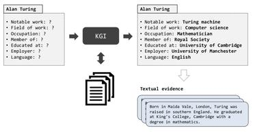
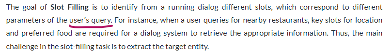

# Goals:

* Given a task : I should know what approach will work

* review of state-of-the-art approaches 

* Project : build a conversational chat-bot that apply both theoretical and practical technique (ML , devops best practices) 

---
## road map 

### 1. text classification tasks :

      text -> bag of words -> compute feature -> apply ML (shallow)

      there a lots of tips to apply here for example using hash trick

### 2. text as sequence (not a bag of words) : 

      language modeling : predict the prob of next word given som prev word
      chat-bots , summarization ...

      sequence tagging:
      name entities , semantic slots

**_project idea_** :  making chat-bot using semantic slot :

  

#### the idea

  

### 3. represent the meaning :

      word embedding , sentence embedding , topic models

      applications : search , ranking ...

### 4. Sequence to sequence :

      using encoder-decoder architecture

      conversational chat-bot , simplification ...

### 5. Dialogue agents:

      Goal oriented (help customer ...)

      Conversational(just hold the dialog )

