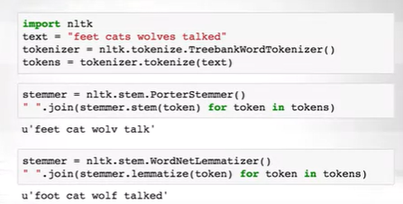

## Text classification

### text preprocessing

*what is text* ?

text can be a sequence of characters ,words or eben  phrases.

*what is a word* ?

* In english we can split a sentence by spaces or punctuations 

**_note_**: it can be more difficult in others languages (in germany there are compounds words wick are written without spaces)

#### **Tockenization**

is the process of splitting a sequences into tokens

token : can be a word , sentence , paragraph ...

      example: simple whitespace tokenizer

      nltk.tokenize.WhitespaceTokenizer

 **_problem_** :  "it"  and "it?" are different tokens with the same meaning 

 there are other different tokenizer

### *token normalization*

we eant the some token for different forms of word

* wolf , wolves -> wolf
* talk , talks -> talk

two approaches : 

   - heuristic based approach : Stemming  , return *stem*

   - morphological based approach (doing thing properly - more costly): Lemmatization return *lemma*

Stemming example:

Porter's stemmer , has 5 heuristic phases of words reductions, applied sequentially 

      nltk.stem.PorterStemmer

      Examples:

      - feet -> feet    cats-> cat
      - wolves -> wolv   talked -> talk

      clearly fails on irregular forms , produces non-word , but still works in practice

Lemmatizer example: WordNet lemmatizer

* uses the  the wordNet Database to lookup lemmas 

      nltk.stem.WordNetLemmatizer

      examples:

      - feet -> foot    cats -> cat
      - wolves -> wolf     talked -> talked

      not all word are reduced

takeaway : we need to try stemming or lemmatization and choose the best for ou task 

example of doing both the task Tockenization and normalization , and try both stemming and Lemmatization 

BONUS:

Further normalization

Us,us -> us (if both are pronoun )
us , US (could be pronoun and country)

we can use heuristic:

      - lowercasing the beginning of the sentence
      - lowercases words i n the titles 
      - leave mid-sentences words as they are 

